## Advanced Lane Lines Finding Project

---


**Project Goals**

The goals of this project are the following:

* Compute the camera calibration matrix and distortion coefficients given a set of chessboard images.
* Apply a distortion correction to raw images.
* Use color transforms, gradients, etc., to create a thresholded binary image.
* Apply a perspective transform to rectify binary image ("birds-eye view").
* Detect lane pixels and fit to find the lane boundary.
* Determine the curvature of the lane and vehicle position with respect to center.
* Warp the detected lane boundaries back onto the original image.
* Output visual display of the lane boundaries and numerical estimation of lane curvature and vehicle position.


## [Rubric](https://review.udacity.com/#!/rubrics/571/view) Points

### The rubric points will be discussed below and brief details about the implementation are also provided.

---


### Camera Calibration

By using provided chessboard images, camera calibration coefficients are calculated.

The code for this step is contained in lines 12 through 37 of the file called `advanced_lane_detection_main.py`. The object points `objpoints` represent the 3D points whereas image points `imgpoints` represent the 2D points. The chessboard images are fixed on the (x, y) plane at z=0, such that the object points are the same for each calibration image. Thus, `objp` is just a replicated array of coordinates and `objpoints` will be appended with a copy of it every time the chessboard corners are successfully detected in a calibration image. The corners detected by the `cv2.findChessboardCorner` are appended to `imgpoints` with each successful detection of corners in a calibration image. The openCV functions `cv2.calibrateCamera` is used to find out the calibration and distortion coefficients. The resulting coefficients are used to undistort the images. For this purpose, `cv2.undistort` function is used. An example image for calibration correction for chessboard image is shown below:

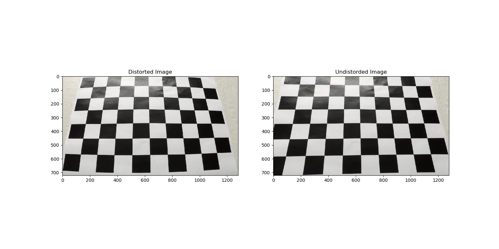

A few of the test images before and after distortion correction are shown below:

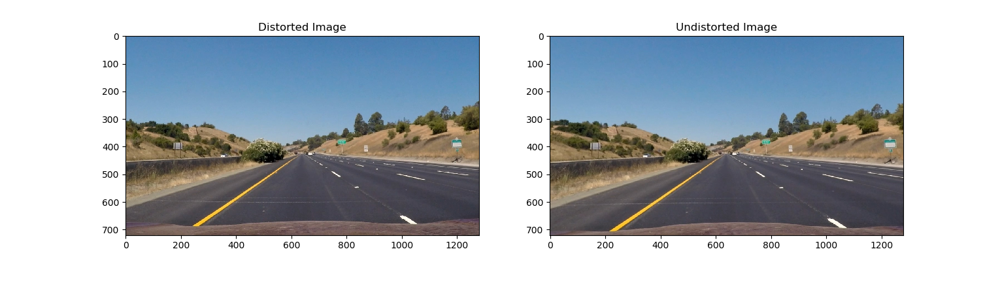
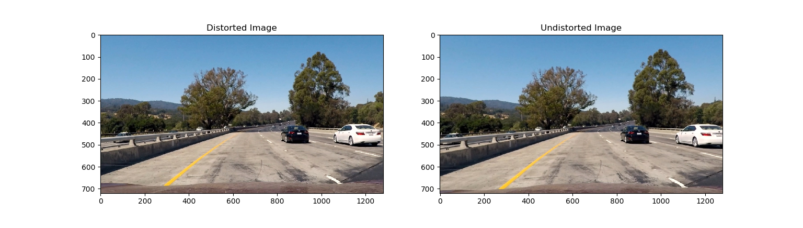
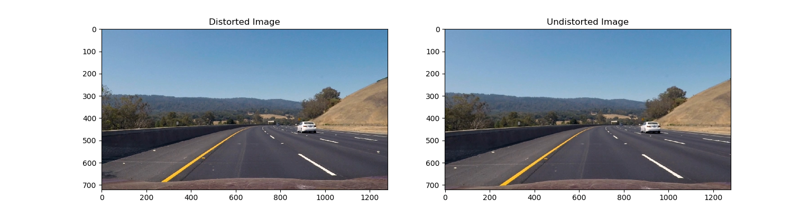

### Threshold Binary Image Creation

The goal of this step is to process the image frame such that the lane pixels are set to 1 whereas non-lane pixels are set to zero.
This is achieved by using various techniques in combination because for the project video, any one technique is not sufficient. The techniques used are:

* Transforming the image to HLS color space and using S-channel
* Apply Sobel-x operator on the image frame. This is equivalent to taking the differential of the image. It highlights the sudden changes in pixel values
* To be able to detect the lanes well in specific situations (shadow of a tree on the road or a patch of road with very light color), the R channel from the RGB color space is used.

Threshold values for each of these methods are found experimentally to filter out lanes. For each of the channels, a binary image is created by setting the pixel value to 1 wherever the pixel value was found to be greater than 0 as shown below:

``` python
57 s_ch_binary[(s_channel >= thresh_s_ch[0]) & (s_channel <= thresh_s_ch[1])] = 1
...
68 sobel_x_binary[(scaled_sobel >= thresh_sobel[0]) & (scaled_sobel <= thresh_sobel[1])] = 1
...
76 binary_r[(r_channel > thresh_r[0]) & (r_channel <= thresh_r[1])] = 1
```

A combined binary image is an image where a pixel is 1 for any one of the above channels.

Examples of results of each of the channels as well as combined binary image are shown below:

S-Channel Binary Image            |  R-Channel Binary Image
:-------------------------:|:-------------------------:
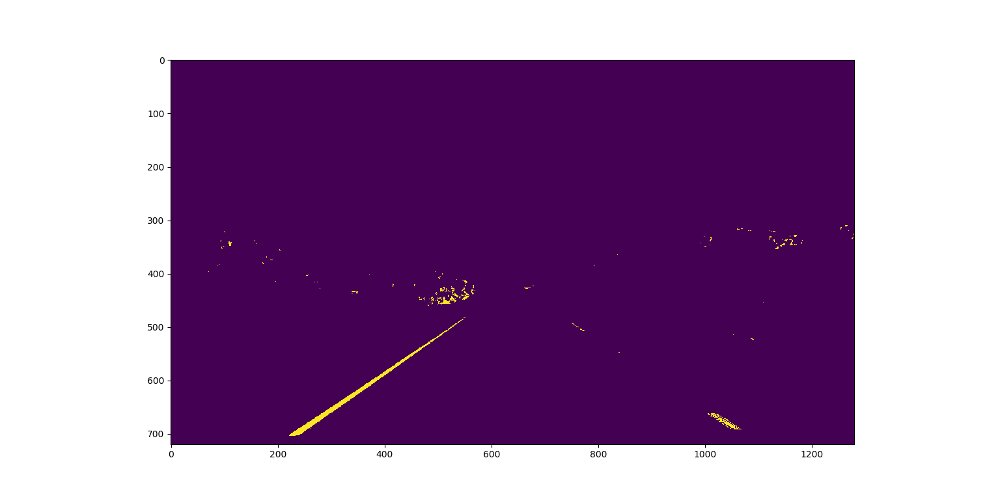  |  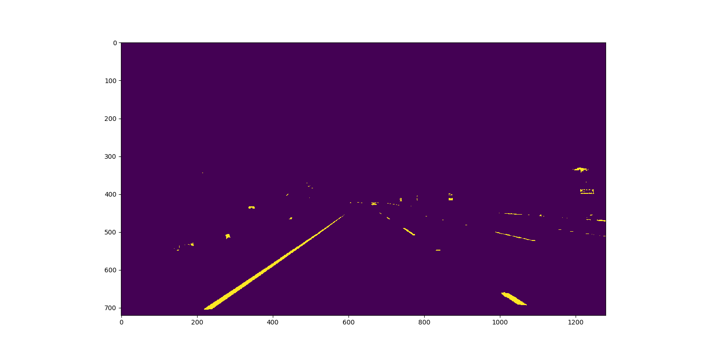

Sobel-x Binary Image              |  Combined Binary Image
:-------------------------:|:-------------------------:
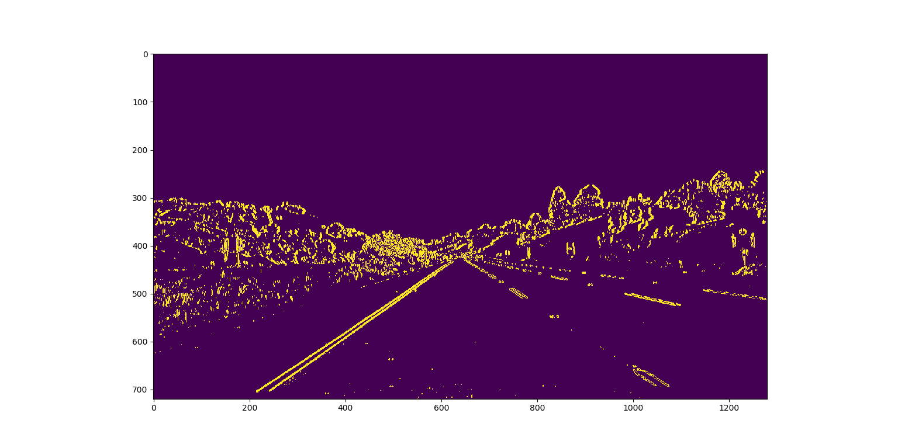  |  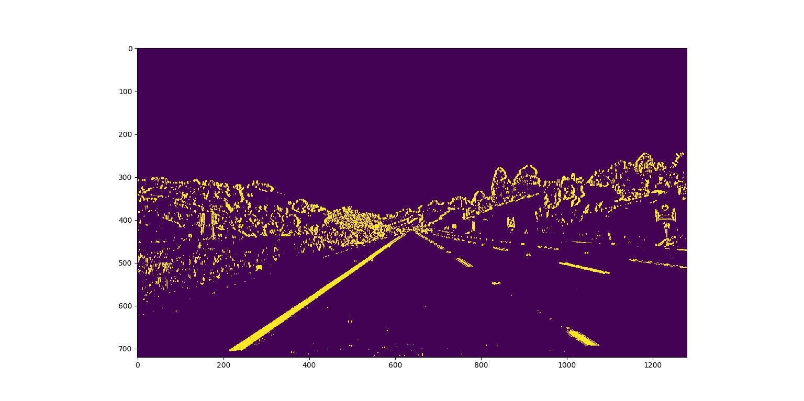

### Perspective Transformation

Due to the perspective of the camera, the lanes in front of the camera, which in reality are parallel, appear to be leaning towards each other.
At the horizon, the lanes even appear to be intersecting. In order to find polynomials for the lane lines, check the distance between lanes or to see if the lanes are parallel to each
other, a transformation of the perspective must be made. The view from the front of the camera is transformed into a bird's eye view.

A trapezoidal area in front of the camera is selected. The coordinates are shown below:

``` python
src = np.float32(
        [[580, 460],
         [1110, 720],
         [205, 720],
         [703, 460]])
```

The trapezoidal area on the image can be seen below:

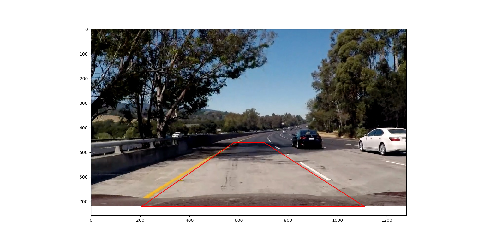

The above mentioned trapezoidal area is transformed over the following rectangular area:

``` python
dst = np.float32(
        [[320, 0],
         [960, 720],
         [320, 720],
         [960, 0]])
```

For the perspective tranform, the openCV function `cv2.getPerspectiveTransform`. The output is a transformation matrix to 
transform the source points to the destination points. The transformation matrix is an input to the `cv2.warpPerspective` 
function. The output is the warped image as shown in the example images below:

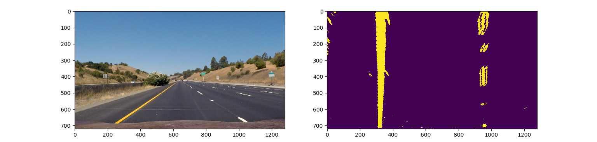
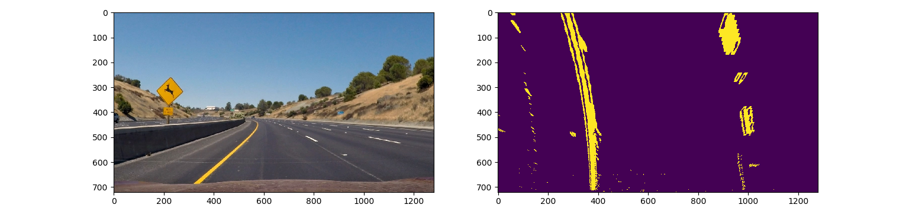

### Lane Pixels Detection and Lane Fitting

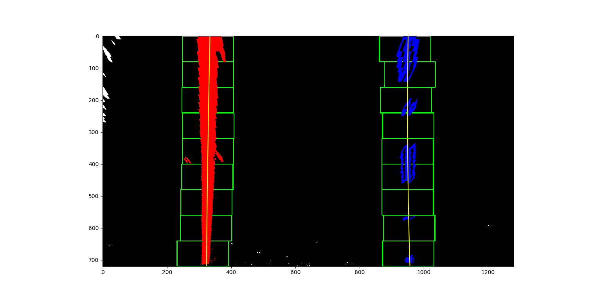
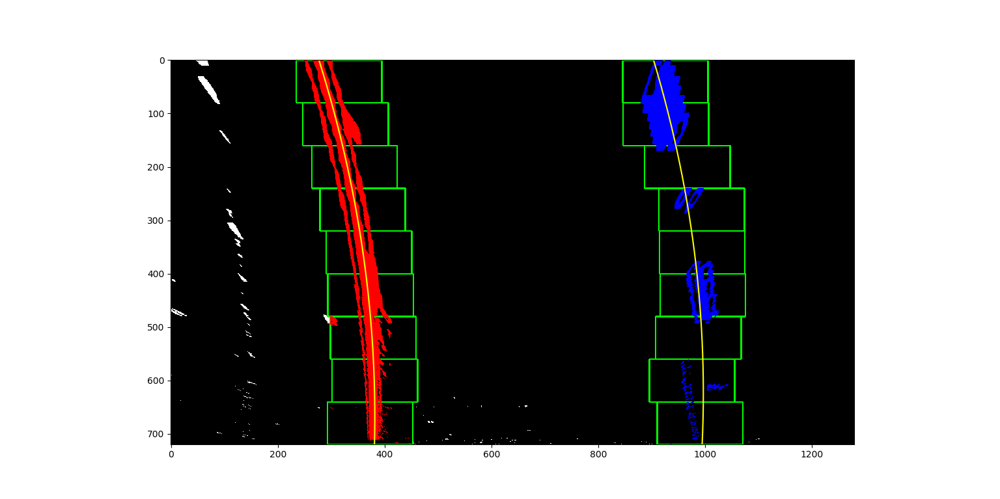

THE PROJECT IS CURRENTLY BEING WORKED ON

To view the project video result for this commit, click here:

[Project Video](/project_video_output.mp4)


