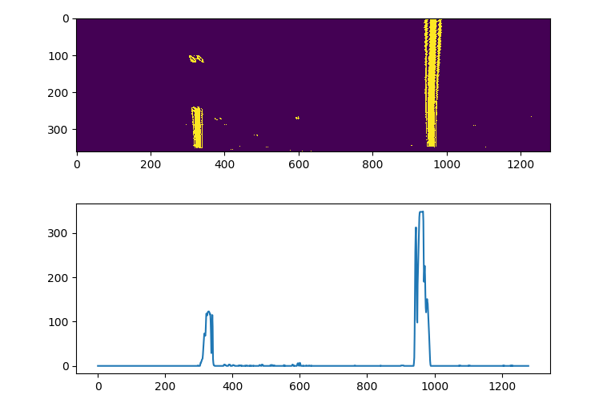
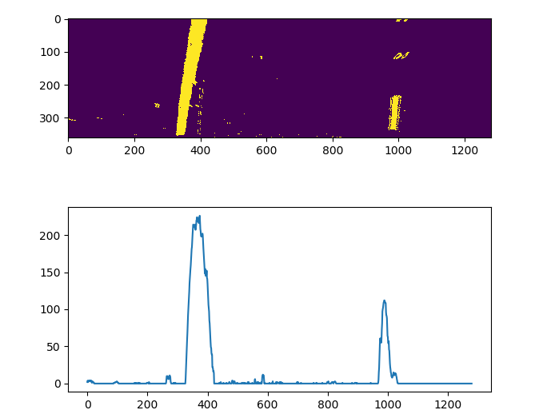
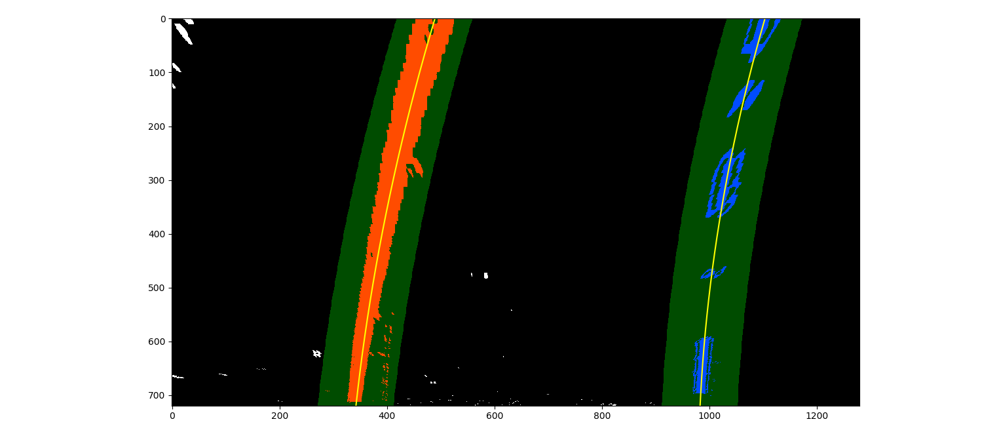
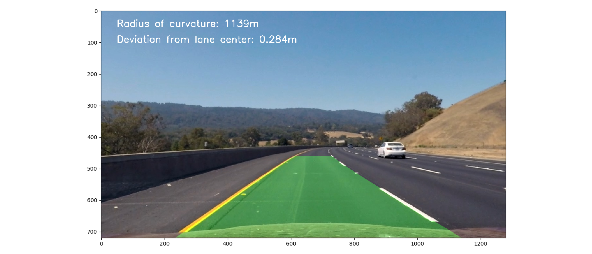

## Advanced Lane Lines Finding Project

---


**Project Goals**

The goals of this project are the following:

* Compute the camera calibration matrix and distortion coefficients given a set of chessboard images.
* Apply a distortion correction to raw images.
* Use color transforms, gradients, etc., to create a thresholded binary image.
* Apply a perspective transform to rectify binary image ("birds-eye view").
* Detect lane pixels and fit to find the lane boundary.
* Perform sanity checks to verify is the found lanes are plausible.
* Determine the curvature of the lane and vehicle position with respect to center.
* Warp the detected lane boundaries back onto the original image.
* Output visual display of the lane boundaries and numerical estimation of lane curvature and vehicle position.


## [Rubric](https://review.udacity.com/#!/rubrics/571/view) Points

### The rubric points will be discussed below and brief details about the implementation are also provided.

---


### Camera Calibration

By using provided chessboard images, camera calibration coefficients are calculated.

The code for this step is contained in lines 12 through 37 of the file called `advanced_lane_detection_main.py`. The object points `objpoints` represent the 3D points whereas image points `imgpoints` represent the 2D points. The chessboard images are fixed on the (x, y) plane at z=0, such that the object points are the same for each calibration image. Thus, `objp` is just a replicated array of coordinates and `objpoints` will be appended with a copy of it every time the chessboard corners are successfully detected in a calibration image. The corners detected by the `cv2.findChessboardCorner` are appended to `imgpoints` with each successful detection of corners in a calibration image. The openCV functions `cv2.calibrateCamera` is used to find out the calibration and distortion coefficients. The resulting coefficients are used to undistort the images. For this purpose, `cv2.undistort` function is used. An example image for calibration correction for chessboard image is shown below:


A few of the test images before and after distortion correction are shown below:


### Threshold Binary Image Creation

The goal of this step is to process the image frame such that the lane pixels are set to 1 whereas non-lane pixels are set to zero.
This is achieved by using various techniques in combination because for the project video, any one technique is not sufficient. The techniques used are:

* Transforming the image to HLS color space and using S-channel
* Apply Sobel-x operator on the image frame. This is equivalent to taking the differential of the image. It highlights the sudden changes in pixel values
* To be able to detect the lanes well in specific situations (shadow of a tree on the road or a patch of road with very light color), the R channel from the RGB color space is used.

Threshold values for each of these methods are found experimentally to filter out lanes. For each of the channels, a binary image is created by setting the pixel value to 1 wherever the pixel value was found to be greater than 0 as shown below:

``` python
57 s_ch_binary[(s_channel >= thresh_s_ch[0]) & (s_channel <= thresh_s_ch[1])] = 1
...
68 sobel_x_binary[(scaled_sobel >= thresh_sobel[0]) & (scaled_sobel <= thresh_sobel[1])] = 1
...
76 binary_r[(r_channel > thresh_r[0]) & (r_channel <= thresh_r[1])] = 1
```

A combined binary image is an image where a pixel is 1 for any one of the above channels.

Examples of results of each of the channels as well as combined binary image are shown below:

S-Channel Binary Image            |  R-Channel Binary Image
:-------------------------:|:-------------------------:
  |  

Sobel-x Binary Image              |  Combined Binary Image
:-------------------------:|:-------------------------:
  |  

### Perspective Transformation

Due to the perspective of the camera, the lanes in front of the camera, which in reality are parallel, appear to be leaning towards each other.
At the horizon, the lanes even appear to be intersecting. In order to find polynomials for the lane lines, check the distance between lanes or to see if the lanes are parallel to each
other, a transformation of the perspective must be made. The view from the front of the camera is transformed into a bird's eye view.

A trapezoidal area in front of the camera is selected. The coordinates are shown below:

``` python
src = np.float32(
        [[580, 460],
         [1110, 720],
         [205, 720],
         [703, 460]])
```

The trapezoidal area on the image can be seen below:


The above mentioned trapezoidal area is transformed over the following rectangular area:

``` python
dst = np.float32(
        [[320, 0],
         [960, 720],
         [320, 720],
         [960, 0]])
```

For the perspective tranform, the openCV function `cv2.getPerspectiveTransform`. The output is a transformation matrix to 
transform the source points to the destination points. The transformation matrix is an input to the `cv2.warpPerspective` 
function. In the code, the perspective transform is done as shown below:

``` python
101 M = cv2.getPerspectiveTransform(src, dst)
102 Minv = cv2.getPerspectiveTransform(dst, src)
103 image_size = (cmb_bin_img.shape[1], cmb_bin_img.shape[0])
104 warped_img = cv2.warpPerspective(cmb_bin_img, M, image_size, flags=cv2.INTER_LINEAR)
```

The output is the warped image as shown in the example images below:


### Lane Pixels Detection and Lane Fitting

To find the lane pixels to start with, the bottom half of the result of the perspective tranformed image is taken and a
histogram is applied on it. The points with the high value on histogram represents the highly likelihood of the presence of 
lanes. Two images are shown as an example below:




Starting at the base points found by the application of histogram, a sliding window method is used to track the lane in the 
image. The number of windows for the image, the margin i.e. the width of the window to find the lane pixels as well as the
minimum number of pixels to be considered are defined empirically for the algorithm. In each window, which is based on the feedback
from the last window, pixels are search, and if at least the defined minimum number of pixels are found, the window is re-centered.
In the code, the function `find_lane_pixels` is where the sliding window method is implemented.

Examples of two images are shown below:


In order to be able to consider the curvature of lanes, a polynomial equation is suitable. The equation is given by:

f(y) = Ax <sup> 2 </sup> + Bx + C

The polynomial coefficients for the lane lines resulting from above are found by using the `polyfit` function of the `numpy` library.
For the next frame, the search for the lane pixels must not start from scratch. The probability is high that in the next frame,
the lane pixel position will not deviate much. Hence, for the consecutive image frames, the lane pixels are search in an area in the
vicinity of the last found lane pixels. For this purpose, the polynomial values of the last image frame are saved. 
The implentation can be found in the `search_around_polynomial` function.
An example is shown below:



### Sanity Check

For the purpose of sanity check, the distance between the lowest points of the left and right lane is calculated. If the distance value
is below 3 meters or higher than 4 meters, then that frame is ignored and at the output, the unprocessed frame is sent. Therefore, in a case
in which the some frames violate the sanity check, the green area in front of the vehicle may flicker.

### Determination of lane curvature and vehicle position

For the calculation of lane curvatures, the pixels are converted to meters. For this purpose, the provided estimate is used which is:

meters in y direction per pixel = 30 / 720

meters in x direction per pixel = 3.7 / 700

For the calculation of radius if curvature, the following formula is used:

R <sub> curve </sub> = (1 + (2Ay + B)<sup>2</sup>)<sup>3/2</sup>/ |2A|

To find out the distance from the center of the lane, the image center is considered as the car position. It is subtracted from the
lane center. The implementation can be found in the `measure_curvature_dist` function.

### Warping Image back to Original Image and Visual Display

Finally, a visualisation of the are between lanes is made with a green highlighted area. The image is then warped back to the original image.
The values of lane curvature and the displacement from the lane center are overlaid on the image. The implementation in the code can be found
in the function `draw_on_image`.
An example of the final image is shown below:



### Pipeline (Video)

To view the project video result for this commit, click here:

[Project Video](/project_video_output.mp4)

### Discussion

The current pipeline is tuned for the project video. On the challenge videos, some issues are identified such as, when due to a road joint,
a line appears somewhere in the area between the two lanes, it disturbs the output i.e. highlighted area flickers between lines.
This can be improved by performing sanity checks at the histogram level i.e. if histogram shows more than two lanes, based on certain
criteria, the wrong lane can be identified and ignored.

The biggest issue faced during this project is the shadow on the road. Generally, the S channel does a good job of detecting lanes,
but in case of the tree shadow on the road, it does not perform so well. The big difficulty was to tune the S channel correctly as well
as to find other potential channels which could be of help. In this particular case, the R channel helped. Nonetheless, testing with images with
a lot of shadows in different constellations may reveal further weaknesses, which can be improved by considering more channels.