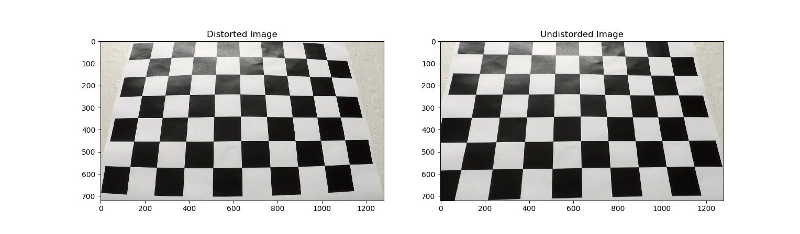

## Advanced Lane Lines Finding Project

---

**Project Goals**

The goals of this project are the following:

* Compute the camera calibration matrix and distortion coefficients given a set of chessboard images.
* Apply a distortion correction to raw images.
* Use color transforms, gradients, etc., to create a thresholded binary image.
* Apply a perspective transform to rectify binary image ("birds-eye view").
* Detect lane pixels and fit to find the lane boundary.
* Determine the curvature of the lane and vehicle position with respect to center.
* Warp the detected lane boundaries back onto the original image.
* Output visual display of the lane boundaries and numerical estimation of lane curvature and vehicle position.

## [Rubric](https://review.udacity.com/#!/rubrics/571/view) Points

### The rubric points will be discussed below and brief details about the implementation are also provided.

---

### Camera Calibration

By using provided chessboard images, camera calibration coefficients are calculated.

The code for this step is contained in lines 12 through 37 of the file called `advanced_lane_detection_main.py`. The object points `objpoints` represent the 3D points whereas image points `imgpoints` represent the 2D points. The chessboard images are fixed on the (x, y) plane at z=0, such that the object points are the same for each calibration image. Thus, `objp` is just a replicated array of coordinates and `objpoints` will be appended with a copy of it every time the chessboard corners are successfully detected in a calibration image. The corners detected by the `cv2.findChessboardCorner` are appended to `imgpoints` with each successful detection of corners in a calibration image. The openCV functions `cv2.calibrateCamera` is used to find out the calibration and distortion coefficients. The resulting coefficients are used to undistort the images. For this purpose, `cv2.undistort` function is used. An example image for calibration correction for chessboard image is shown below:

An example of the road image before and after distortion correction is shown below:

The effect of distortion correction is very visible at the left and right edges of the image.

## THE PROJECT IS CURRENTLY BEING WORKED ON

To view the project video result for this commit, click here:

[Project Video](/output_images/project_video.mp4)
